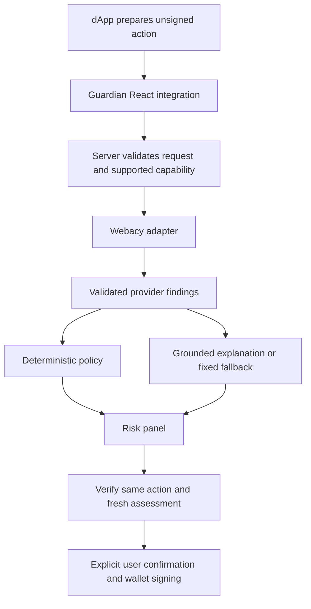

# Proposed architecture

Design only. No runtime, schema, decision authority, or shared assurance contract is created by this document.

## Components

Proposed TypeScript workspace: `apps/demo`, `packages/react`, `packages/core`, and `packages/webacy`. Start with one Node server within the reference app; a separate Hono service, Turborepo, Redis, billing, and Telegram app are unnecessary for the first proof.

The provider adapter owns verified field mappings and chain-specific capabilities. The core owns deterministic policy. React owns accessible presentation and explicit signing integration. AI receives only the minimum normalized findings required to explain a result.

## Signing boundary

- Prove unsigned payload support first. A scan requiring an already-issued signature cannot support a pre-signing protection claim. Never ask a user to sign a dangerous message merely to scan it.
- Bind the assessment to the complete action, account, chain, domain, and policy version. Use stable canonical encoding and SHA-256 for internal binding; preserve protocol-native wallet hashing as required by the chain.
- Any payload mutation, account change, chain change, expiry, or insufficient state freshness invalidates the assessment and requires another scan.
- Guard transaction sending and typed-data signing explicitly. Unsupported methods, smart-account batches, or new permit formats stop the protected flow until separately qualified.
- The client integration can be bypassed by another client or dApp. Server checks protect only server-controlled actions; neither component has universal wallet enforcement authority.

## Proposed policy behavior

| Condition | Intended UI behavior |
| --- | --- |
| Complete coverage, no configured blocking signal | Show findings and limits; require user confirmation |
| Review signal | Show warning and require explicit acknowledgement if policy permits |
| Blocking signal | Do not invoke the protected signing function |
| Missing, malformed, stale, unsupported, or unavailable scan | Display unavailable and do not invoke signing |

A policy pass means only that the configured checks passed. Never label an asset or transaction SAFE. Do not average unrelated provider scores or let an LLM create a risk score. Policy design must be authorized and tested before implementation; this table is not a runtime contract.

## AI and data handling

Explanations must reference allowed provider fields. Treat token names, URLs, contract text, and other external strings as untrusted data, not instructions. Reject invented assertions and use fixed explanatory text when output validation fails. Changing LLM output must never change the policy result. LLM text is nondeterministic and is not governed evidence.

Keep API and LLM keys server-side. Set request size limits, authentication appropriate to the integration, rate limits, and timeouts. Do not log full wallet histories, signed payloads, or secrets. Do not browse user-supplied URLs on the server; send validated URLs only to the approved risk provider. Define retention and provider data rights before pilot collection.

Avoid a blanket five-minute cache for signing decisions. Transaction and signature assessments need request binding and a tested freshness policy. Read-only screening may use provider-appropriate caching with age displayed. Clock/block context must be explicit inputs to reproducible policy tests.

## Delivery boundaries

No custody, seed phrases, transaction execution by the AI, automatic revocation, deployed smart contracts, or autonomous trading. Approval review is read-only. Revocation, if later authorized, requires a separately reviewed flow and individual wallet confirmation.

Any future commercial or compliance outcome that relies on AxiomOrdo assurance must use its authorized shared trace family. This proposal neither imports that authority nor invents a replacement trace schema.
